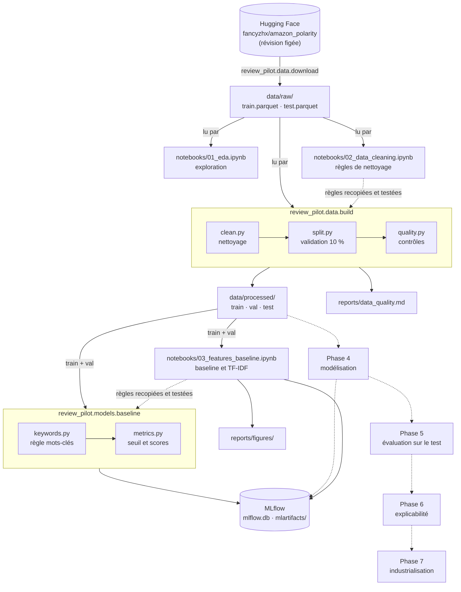
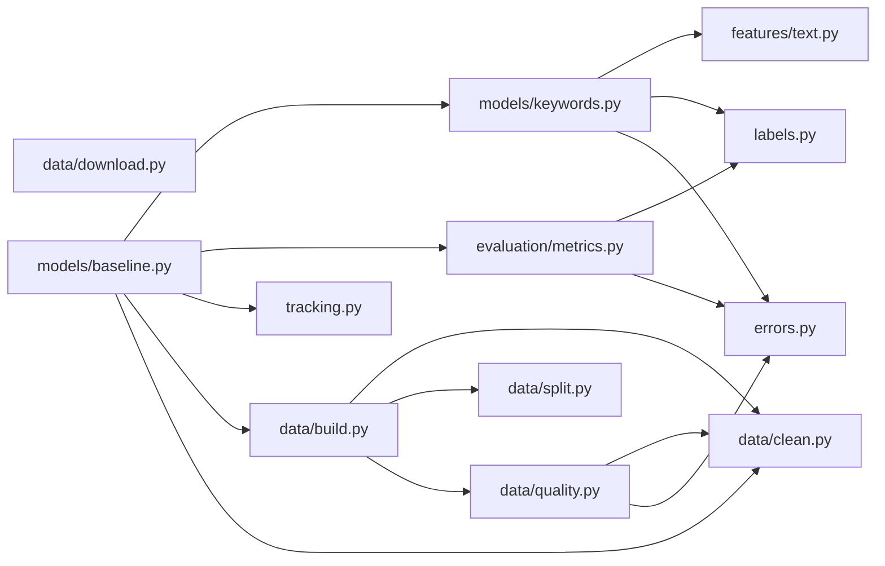

# Architecture : la ligne de vie de ReviewPilot

Ce document montre comment les fichiers du projet s'enchaînent, des avis bruts jusqu'au modèle :
qui produit quoi, qui lit quoi, et avec quelle commande. Il est mis à jour à la fin de chaque
phase du projet (suivi des phases : [projet-ia.md](projet-ia.md) ; détail du code, fonction par
fonction : [code.md](code.md)).

## Vue d'ensemble

Les flèches pleines existent déjà ; les flèches en pointillé sont les phases à venir.



## Les étapes, dans l'ordre

| # | Étape | Commande | Lit | Produit | Code |
|---|---|---|---|---|---|
| 1 | Télécharger l'échantillon | `uv run python -m review_pilot.data.download` | Hugging Face (révision figée) | `data/raw/train.parquet` (50 000 avis), `data/raw/test.parquet` (10 000 avis), cache `data/.cache/` | `src/review_pilot/data/download.py` |
| 2 | Explorer les données (EDA) | notebook, « Run All » | `data/raw/` | des conclusions (aucun fichier) | `notebooks/01_eda.ipynb` |
| 3 | Décider le nettoyage | notebook, « Run All » | `data/raw/` | des règles vérifiées (aucun fichier) | `notebooks/02_data_cleaning.ipynb` |
| 4 | Construire les jeux propres | `uv run python -m review_pilot.data.build` | `data/raw/` | `data/processed/{train,val,test}.parquet`, `reports/data_quality.md` | `src/review_pilot/data/build.py` |
| 5 | Décider la baseline et les features | notebook, « Run All » | `data/processed/` (train et val) | `reports/figures/03_*.png`, 2 runs MLflow | `notebooks/03_features_baseline.ipynb` |
| 6 | Mesurer la baseline | `uv run python -m review_pilot.models.baseline` | `data/processed/` (train et val) | 2 runs MLflow (`majority`, `keywords`) dans `mlflow.db` et `mlartifacts/` | `src/review_pilot/models/baseline.py` |
| 7 | Modélisation | *(phase 4, à venir)* | `data/processed/` | | |

Les étapes 2 et 3 n'écrivent rien : elles servent à **comprendre et décider**. Les étapes 1 et 4
se relancent à l'identique (graine fixe, révision figée). Les étapes 5 et 6 ajoutent des runs
MLflow à chaque lancement : MLflow garde tout l'historique, chaque run est daté.

Le jeu de **test** n'est lu par aucune étape après la 4 : il est réservé à la phase 5.

## Rôle de chaque dossier

```text
review-pilot/
├── src/review_pilot/        # le code du projet (testé)
│   ├── __init__.py          # point d'entrée « review-pilot » (provisoire)
│   ├── errors.py            # exceptions du projet (DataQualityError, ThresholdNotFoundError…)
│   ├── labels.py            # NEGATIVE = 0, POSITIVE = 1
│   ├── tracking.py          # connexion à MLflow (mlflow.db, mlartifacts/)
│   ├── data/                # tout ce qui touche aux données
│   │   ├── download.py      # étape 1 : échantillon brut depuis Hugging Face
│   │   ├── clean.py         # règles de nettoyage (phrases collées, HTML, langue, données perso, doublons)
│   │   ├── split.py         # découpage train / validation stratifié
│   │   ├── quality.py       # contrôles de qualité, bloquants
│   │   └── build.py         # étape 4 : enchaîne clean → split → quality, écrit les fichiers
│   ├── features/
│   │   └── text.py          # découpage en mots et TF-IDF (prêt pour la phase 4)
│   ├── models/
│   │   ├── keywords.py      # la règle mots-clés (fit / predict)
│   │   └── baseline.py      # étape 6 : mesure les baselines, les enregistre dans MLflow
│   └── evaluation/
│       └── metrics.py       # métriques du projet et choix du seuil de décision
├── notebooks/               # un par phase : on comprend et on décide ici, avant le code
│   ├── 01_eda.ipynb
│   ├── 02_data_cleaning.ipynb
│   └── 03_features_baseline.ipynb
├── data/                    # jamais versionné (sauf data/README.md)
│   ├── raw/                 # données brutes, jamais modifiées
│   ├── processed/           # jeux propres, recréés par l'étape 4
│   └── .cache/              # cache de téléchargement (supprimable)
├── reports/                 # data_quality.md (étape 4) et figures/ (notebooks)
├── mlflow.db                # journal MLflow des essais (jamais versionné)
├── mlartifacts/             # fichiers joints aux essais MLflow (jamais versionné)
├── tests/unit/              # tests du code de src/ (un dossier par paquet, un fichier par module)
└── docs/
    ├── projet-ia.md         # suivi des phases : cadre, décisions, avancement
    ├── architecture.md      # ce document
    └── code.md              # guide du code, fichier par fichier
```

## Qui appelle quoi dans `src/`



`download.py` est indépendant : il ne sert qu'à produire `data/raw/`. `baseline.py` réutilise
`build.py` pour les chemins des jeux propres, et `clean.py` pour le texte lu (titre + contenu).
`features/text.py` fournit aussi le TF-IDF, qui n'est encore utilisé par aucune commande : il
servira aux modèles de la phase 4.

Les notebooks n'importent pas le code de `src/` : leur code est volontairement recopié, pour
rester lisible et garder la trace du raisonnement.

## Les règles qui tiennent l'ensemble

- **Les données brutes ne sont jamais modifiées** : tout part de `data/raw/`, et tout le reste
  se recrée avec les commandes ci-dessus.
- **Le test reste intact jusqu'à la phase 5** : il est nettoyé avec les mêmes règles que le
  train, mais aucun modèle n'est évalué dessus avant.
- **Tout ce qui apprend, apprend sur le train** (listes de mots-clés, vocabulaire TF-IDF) ; la
  validation sert à mesurer et à régler (taille des listes, seuil). Vérifié par des tests.
- **Chaque essai de modèle est enregistré dans MLflow**, avec ses réglages, ses scores et ses
  fichiers joints.
- **Notebook d'abord, code ensuite** : chaque phase est décidée dans un notebook, validée, puis
  recopiée dans `src/` avec des tests. Le code doit produire exactement les mêmes résultats que
  le notebook (vérifié : jeux identiques ligne à ligne en phase 2, mêmes scores de baseline en
  phase 3).
- **Les contrôles de qualité sont bloquants** : si un jeu produit ne les respecte pas,
  `build` s'arrête avec une `DataQualityError` au lieu d'écrire des données abîmées.
- **Ne sont versionnés que le code, les notebooks (sans leurs sorties), les rapports et les
  documents** : les données, le cache, le journal MLflow et les futurs modèles restent en local.
